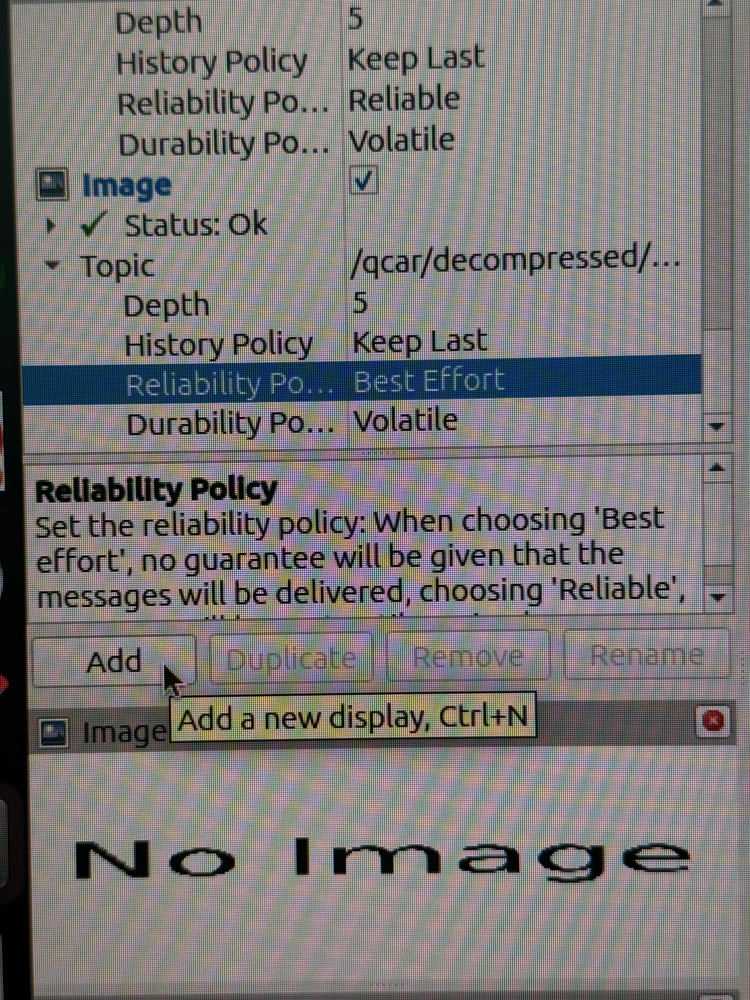
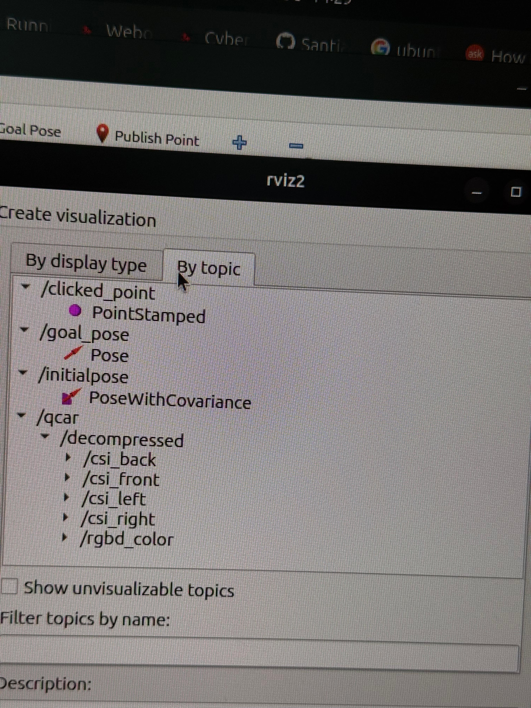
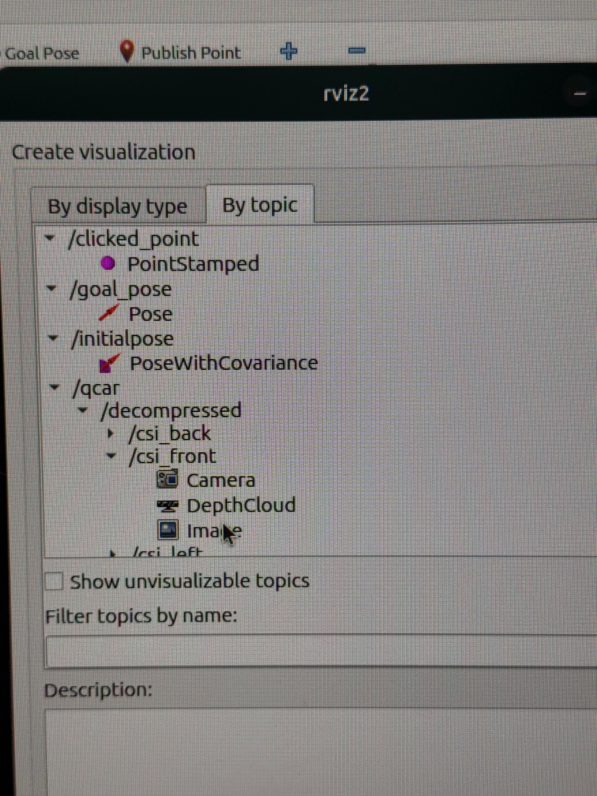
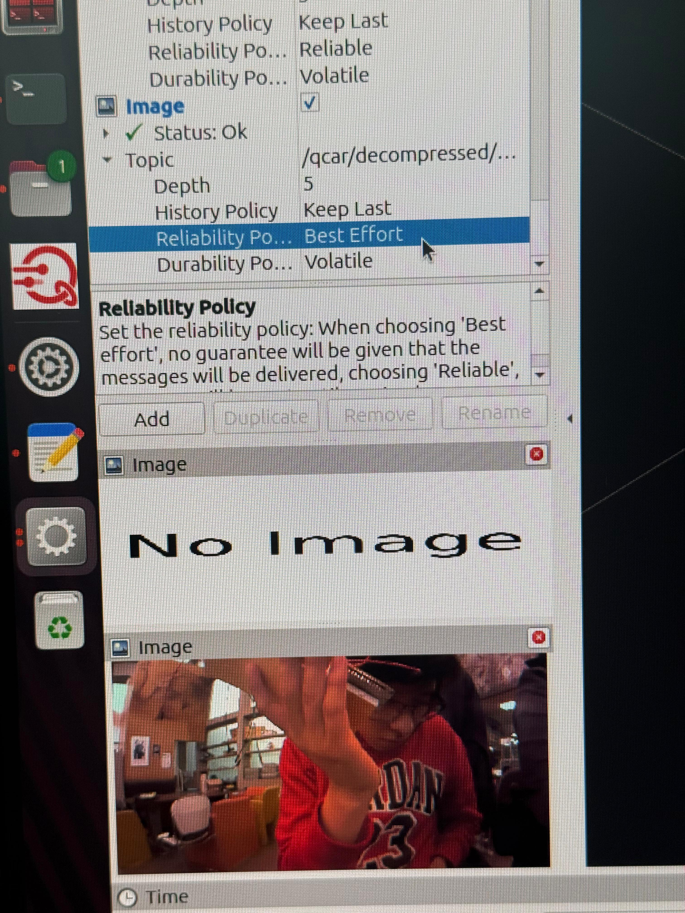

# QCar Recording and Playback Guide (ROS 2)

This guide walks you through connecting to your QCar, verifying camera streams, recording a ROS 2 bag, and replaying it in RViz2.

> For questions about powering on the QCar, topics, nodes, etc., see the [QCar ROS2 Quick Start Guide](https://github.com/dsosa114/movilidad_inteligente/blob/main/Documentation/QCar_ROS2_Quick_Start_Guide.md).

---

## Before You Start

You will use **several terminals**. Keep each one open unless told otherwise.

| Terminal | Purpose |
|----------|---------|
| Terminal 1 | SSH into the QCar and run the QCar launch file |
| Terminal 2 | Image decompressor |
| Terminal 3 | Topic checks and recording |
| Terminal 3 | Playback |
| Terminal 4 | RViz2 |

---

## 1. Access the Onboard Computer (SSH)

- **Default password:** `nvidia`
- **IP address:** shown on the QCar's LCD display.
- **Network:** all QCars connect to the `Mocap_UVS` network by default.

> **Note:** Avoid connecting the router to the internet. It is optimized for LAN usage.

<details>
<summary><b>Select your QCar color</b></summary>

<details>
<summary>🔴 Red</summary>

```sh
ssh -X nvidia@192.168.1.6
```

</details>

<details>
<summary>🟢 Green</summary>

```sh
ssh -X nvidia@192.168.1.2
```

</details>

<details>
<summary>🔵 Blue</summary>

```sh
ssh -X nvidia@192.168.1.4
```

</details>

</details>

---

## 2. Run ROS 2 Nodes on the QCar

To run the installed nodes, switch to Super User mode:

```sh
sudo -s
```

Default password: `nvidia`

### Launch Files

Each QCar has its own launch file for its specific hardware configuration.

| QCar Platform | Launch File | Default `nodes` Argument |
|---------------|-------------|--------------------------|
| Blue | `qcar_blue.launch.py` | `'qcar,csi,rgbd,lidar_qos,imu_external'` |
| Green | `qcar_green.launch.py` | `'qcar,csi,rgbd,lidar_qos'` |
| Red | `qcar_red.launch.py` | `'qcar,csi_redpatch,rgbd,lidar_qos'` |

### Launch Commands

To view all available arguments for a platform:

```sh
ros2 launch -s qcar qcar_{platform_color}.launch.py
```

To launch with remote control (joystick) enabled:

```sh
ros2 launch qcar qcar_{platform_color}.launch.py nodes:='command,qcar,csi,rgbd,lidar_qos'
```

<details>
<summary><b>Select your QCar color to get the launch command</b></summary>

<details>
<summary>🔴 Red</summary>

```sh
ros2 launch qcar qcar_red.launch.py
```

</details>

<details>
<summary>🟢 Green</summary>

```sh
ros2 launch qcar qcar_green.launch.py
```

</details>

<details>
<summary>🔵 Blue</summary>

```sh
ros2 launch qcar qcar_blue.launch.py
```

</details>

</details>

> ⚠️ **Leave this terminal running.** Open a **new terminal** for the next steps.

---

## Step 1 — Set the ROS Domain ID (Multi-Robot Coordination)

terminal 2:

To prevent network interference when several QCars operate at the same time, each platform has a unique `ROS_DOMAIN_ID`:

| QCar Platform | `ROS_DOMAIN_ID` |
|---------------|-----------------|
| Blue | 114 |
| Green | 115 |
| Red | 116 |

> ⚠️ **Run this command in every new terminal you open** (decompressor, checks, recording, playback, RViz2).

<details>
<summary><b>Select your QCar color</b></summary>

<details>
<summary>🔴 Red</summary>

```sh
export ROS_DOMAIN_ID=116
```

</details>

<details>
<summary>🟢 Green</summary>

```sh
export ROS_DOMAIN_ID=115
```

</details>

<details>
<summary>🔵 Blue</summary>

```sh
export ROS_DOMAIN_ID=114
```

</details>

</details>

---

## Step 2 — Start the Image Decompressor
terminal 2: 
In the same  **terminal** (with your `ROS_DOMAIN_ID` set):

```sh
ros2 launch vision_helpers_pkg qcar_image_decompressor.launch.py
```

> **Leave this running as well.**

---

## Step 3 — Verify That Images Are Arriving OPTIONAL

terminal 3:

Open a **new terminal** (set your `ROS_DOMAIN_ID` again). Before recording, check that the decompressed topics exist:

```sh
ros2 topic list | grep /qcar/decompressed
```

Then test the front camera:

```sh
ros2 topic hz /qcar/decompressed/csi_front
```

> **⚠️ This step is important.** You must see an `average rate` **greater than zero**.

You can also check the other cameras:

```sh
ros2 topic hz /qcar/decompressed/csi_right
```

```sh
ros2 topic hz /qcar/decompressed/csi_back
```

```sh
ros2 topic hz /qcar/decompressed/csi_left
```

```sh
ros2 topic hz /qcar/decompressed/rgbd_color
```

---

## Step 4 — Record 

terminal 3:

Once you have confirmed that the topics are publishing, set your **name** and **QCar color** below. The bag name is built automatically with the **current date and time**.

Edit only the first two lines (`STUDENT_NAME` and `QCAR_COLOR`), then paste the whole block:

```sh
STUDENT_NAME="Ayleen"      # <-- change to your name
QCAR_COLOR="green"         # <-- red, green, or blue

export BAG_NAME="${STUDENT_NAME}_${QCAR_COLOR}QCar_$(date +%Y_%m_%d_%H_%M)"
echo "Recording to: tmr_recordings/${BAG_NAME}"

ros2 bag record --topics \
/qcar/decompressed/csi_front \
/qcar/decompressed/csi_right \
/qcar/decompressed/csi_back \
/qcar/decompressed/rgbd_color \
/qcar/decompressed/csi_left \
-o tmr_recordings/${BAG_NAME}
```

Example of the generated name: `Ayleen_greenQCar_2026_10_08_13_19`

> **Write down the name that `echo` prints.** You will need it in Steps 5 and 6.

Leave it recording. To stop:

```
Ctrl+C
```

---

## Step 5 — Verify the Recording Is NOT Empty OPTIONAL

terminal 3:

Use the same terminal (so `BAG_NAME` is still set):

```sh
ros2 bag info tmr_recordings/${BAG_NAME}
```

If you opened a new terminal, replace `${BAG_NAME}` with the name you wrote down (e.g. `Ayleen_greenQCar_2026_10_08_13_19`).

Confirm that the output shows:

```
Messages:    > 0
```

and that **every topic has a `Count` greater than zero**.

---

## Step 6 — Replay

terminal 3:

1. Press `Ctrl+C` in **Terminal 1** (the one running `ros2 launch qcar qcar_{platform_color}.launch.py`).
2. In a terminal with your `ROS_DOMAIN_ID` set, play the bag:

```sh
ros2 bag play tmr_recordings/${BAG_NAME} --loop
```

Or with the name typed out, for example:

```sh
ros2 bag play tmr_recordings/Ayleen_greenQCar_2026_10_08_13_19 --loop
```
if you use the same terminal (terminal 3) opcion 2 is not necesary
---

## Step 7 — Open RViz2
terminal 4:

In another new terminal, set your `ROS_DOMAIN_ID` again:

<details>
<summary><b>Select your QCar color</b></summary>

<details>
<summary>🔴 Red</summary>

```sh
export ROS_DOMAIN_ID=116
```

</details>

<details>
<summary>🟢 Green</summary>

```sh
export ROS_DOMAIN_ID=115
```

</details>

<details>
<summary>🔵 Blue</summary>

```sh
export ROS_DOMAIN_ID=114
```

</details>

</details>

Then launch RViz2:

```sh
rviz2
```

Next, add the camera view:

1. Click **Add → By topic**.

 <p align="center">
  
</p>

<p align="center">
  
</p>

2. Select the topic `/qcar/decompressed/csi_front` and choose **Image**.

<p align="center">
  
</p>


3. Repeat the process to add more **Image** displays for:

```
csi_right
csi_back
csi_left
rgbd_color
```

4. In each Image display, expand **Reliability Policy** and select **Best Effort**.


<p align="center">
  
</p>


---

## Summary of the Workflow

```
QCar / ROS
   ↓
qcar_image_decompressor
   ↓
verify with ros2 topic hz
   ↓
ros2 bag record
   ↓
ros2 bag info
   ↓
ros2 bag play --loop
   ↓
RViz2
```

> **⚠️ Do not start recording until** `ros2 topic hz /qcar/decompressed/csi_front` **shows a non-zero frequency.**